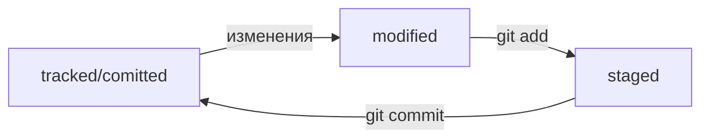

# Шпаргалка по основным командам Git

## Сделать папку репозиторием — `git init`

```bash
$ mkdir -p ~/dev/first-project # создали каталог dev, каталог проекта

$ cd ~/dev/first-project # перешли в нужный каталог

$ git init # создали репозиторий
```

## «Разгитить» папку, если что-то пошло не так, — `rm -rf .git`

```bash
$ cd <папка с репозиторием> # перешли в папку

$ rm -rf .git # удалили подпапку .git
```
## Проверить состояние репозитория — `git status`

```bash
$ git status # создали репозиторий
```

## Подготовить файлы к сохранению — `git add`

```bash
$ touch todo.txt readme.txt # создали файлы todo.txt и readme.txt

$ git status # проверили статус

$ git add --all # подготовили к сохранению все файлы в репозитории

$ touch new.txt
$ git add new.txt # добавить один файл new.txt

$ git add . # а можно добавить всю текущую папку
```

## Удаление файла из репозитория - `git rm`

```bash
$ git rm filename.txt   # команда удаляет файла из рабочего каталога и индекса
                        # а затем добавляет изменение в индекс
```
`git rm filename` = `rm filename` + `git add .`

## Выполнить коммит — `git commit`

```bash
$ git commit -m 'initial commit'
```

## Просмотреть историю коммитов — `git log`

```bash
$ git log
```

Описание состоит из:
 * строка из цифр и латинских букв после слова commit — это хеш коммита;
 * Author — имя автора и его электронная почта;
 * Date — дата и время создания коммита;
 * в конце находится сообщение коммита.

## Получить сокращённый лог — `git log --oneline`

```bash
$ git log --oneline
```


# Инструкция по созданию репозитория на GitHub

1. Зайдите в свой профиль по ссылке https://github.com/username
2. Создайте репозиторий: **Repositories** -> **New**
3. Назовите репозиторий
4. Нажмите **Create repository**

# Доступ по SSH

## Проверка наличия SSH-ключа

```bash
$ cd ~ # перешли в домашнюю директорию

$ ls -la .ssh/ # вывели список созданных ключей 
```

Если есть файлы с похожими названиями, SSH-ключи уже создавались:
 - `id_dsa.pub`;
 - `id_ecdsa.pub`;
 - `id_ed25519.pub`;
 - `id_rsa.pub`.
 
 ## Инструкция по генерации SSH-ключа
 
 1. Для генерации SSH-пары можно использовать программу `ssh-keygen`
 
 ```bash
 $ ssh-keygen -t ed25519 -C "электронная почта, к которой привязан ваш аккаунт на GitHub"
 
 # или
 
 $ ssh-keygen -t rsa -b 4096 -C "электронная почта, к которой привязан ваш аккаунт на GitHub"
 ```
 
 2. Укажите место хранения ключей. Например домашний каталог - просто нажмите `Enter`
 
 3. Укажите **кодовую фразу** (passphrase) для доступа к SSH-ключу. Можно оставить поле пустым
 
 4. Проверяем что ключи сгенерировались
 
 ```bash
 ls -a ~/.ssh
 ```
 Файл с расширением `.pub` - публичный, без - приватный.
 
 ## Инструкция по связыванию SSH-ключа и GitHub-аккаунта
 
 1. Скопируйте содержимое файла с публичным ключом в буфер обмена
 
 ```bash
 # скопировать содержимое ключа в буфер обмена:
 $ clip < ~/.ssh/id_rsa.pub
 
 # для ed25519:
 $ clip < ~/.ssh/id_ed25519.pub
 ```
 
 2. Перейдите на GitHub и выберите пункт Settings в меню аккаунта
 3. В меню слева нажмите на пункт **SSH and GPG keys**
 4. В открывшейся вкладке выберите **New SSH key**
 5. В поле **Title** напишите название ключа. Например, **Personal key**
 6. В поле **Key type** должно быть **Authentication Key**
 7. В поле **Key** скопируйте ваш ключ из буфера обмена
 8. Нажмите на кнопку **Add SSH key**
 9. Проверьте правильность ключа с помощью следующей команды
 
 ```bash
 $ ssh -T git@github.com
 ```
 
 В первый раз появится похожее предупреждение
 
 ```bash
 The authenticity of host 'github.com (140.82.121.4)' can't be established. ED25519 key fingerprint is SHA256:+DiY3wvvV6TuJJhbpZisF/zLDA0zPMSvHdkr4UvCOqU. This key is not known by any other names. Are you sure you want to continue connecting (yes/no/[fingerprint])?
 ```
 
 Это предупреждение сообщает, что вы никогда не соединялись с сервером GitHub. Поэтому Git не может гарантировать, что сервер является тем, за кого он себя выдаёт.
 
 Для подтверждения подлинности сервер генерирует и публикует ключи SHA256. Вы можете проверить ключи GitHub [по этой ссылке](https://docs.github.com/en/authentication/keeping-your-account-and-data-secure/githubs-ssh-key-fingerprints). Если ключ в предупреждении совпадает с тем, что вы видите на сайте, значит, сервер является действительным. Введите yes, чтобы продолжить. Вы увидите приветствие на экране.

 ```bash
 Hi %ВАШ_АККАУНТ%! You've successfully authenticated, but GitHub does not provide shell access.
 ```
 
# Связываем локальный и удалённый репозитории

## Привязать удалённый репозиторий к локальному — `git remote add`

 1. Перейдите на страницу удалённого репозитория, выберите тип `SSH` и скопируйте `URL`

 2. В каталоге локального репозитория введите команду `git remote add [name] [URL]`
 
 ```bash
 $ cd ~/dev/first-project
 $ git remote add origin git@github.com:%ИМЯ_АККАУНТА%/first-project.git
 ```
 
## Убедиться, что репозитории связаны, — `git remote -v`

```bash
$ git remote -v
origin    git@github.com:%ИМЯ_АККАУНТА%/%ИМЯ-ПРОЕКТА%.git (fetch)
origin    git@github.com:%ИМЯ_АККАУНТА%/%ИМЯ-ПРОЕКТА%.git (push)
```

## Отправить изменения на удалённый репозиторий — `git push`

```bash
$ git push -u origin main # Если команда приведёт к ошибке, попробуйте 
                          # заменить main на master.
```

В первый раз эту команду нужно вызвать с флагом `-u` и параметрами `origin`  и `main` (или `master`).
Флаг `-u` свяжет локальную ветку с одноимённой удалённой.

В дальнейшем при работе с удалённым репозиторием флаг `-u` можно опустить и писать просто `git push`.


# Файл HEAD

Файл `HEAD` — один из служебных файлов папки `.git`. Он указывает на коммит, который сделан последним (то есть на самый новый).

```bash
$ pwd # посмотрели, где мы
/Users/user/dev/first-project

$ cd .git/
$ ls # посмотрели, какие есть файлы
COMMIT_EDITMSG  ORIG_HEAD  description  index  logs/     refs/
HEAD            config     hooks/       info/  objects/

$ cat HEAD # команда cat показывает содержимое файла
ref: refs/heads/master # в файле вот такая ссылка
```

Внутри `HEAD` — ссылка на служебный файл: `refs/heads/master`

Если заглянуть в этот файл, можно увидеть хеш последнего коммита.

```bash
$ cat refs/heads/master # взяли ссылку из файла HEAD
# внутри хеш
e007f5035f113f9abca78fe2149c593959da5eb7

$ git log 
# сверяем с хешем последнего коммита
commit e007f5035f113f9abca78fe2149c593959da5eb7
Author: John Doe <johndoe@example.com>
Date:   Tue Mar 28 00:26:53 2023 +0300

    Добавить амбиций в список дел

... # другие коммиты 
```


# Статусы файлов в Git




# Оформление сообщений к коммитам

В выводе команды `git log --oneline` умещается максимум 72 первых символа сообщения, поэтому многие правила включают пункт: *«Сообщение не должно быть длиннее 72 символов»*.

У каждого коммита в Git есть сообщение — то, что передаётся после параметра `-m`.

Общие рекомендации:
 * сообщение должно быть относительно коротким, чтобы его было легко прочитать;
 * сообщение должно быть информативным.


В корпоративном стиле в начале сообщения обычно указывают Jira-ID, а после — текст сообщения.

```bash
$ git commit -m "LGS-123: Дополнить список пасхалок новыми числами"
```

**Conventional Commits** предлагает такой формат коммита: `<type>: <сообщение>`.
 * `feat` — для новой функциональности;
 * `fix` — для исправленных ошибок.

Подробнее [тут](https://www.conventionalcommits.org/ru/v1.0.0-beta.4/#%D1%81%D0%BF%D0%B5%D1%86%D0%B8%D1%84%D0%B8%D0%BA%D0%B0%D1%86%D0%B8%D1%8F).

**GitHub** можно использовать для ведения списка задач *(issue)* проекта. Если коммит «закрывает» или «решает» какую-то задачу, то в его сообщении удобно указывать ссылку на неё. Для этого в любом месте сообщения нужно указать `#<номер задачи>`.

```bash
$ git commit -m "Исправить #334, добавить график температуры" 
```

В таком случае GitHub свяжет коммит и задачу.


# Как исправить коммит

В уже сделанный *commit* можно внести правки с помощью опции `--amend`.

Флаг `--amend` работает *только* с последним коммитом **HEAD**

## Дополнить коммит новыми файлами — `git commit --amend --no-edit`

```bash
$ mkdir ~/dev/commit-amend-fun
$ cd ~/dev/commit-amend-fun
$ git init
# пропустим вывод git init 
$ touch main.html
$ touch common.css
# дальше отредактировали оба файла
$ git add main.html
$ git commit -m "Добавить главную страницу"
$ git log --oneline
777fec3 Добавить главную страницу 
# файл common.css так и остался «висеть» в untracked
$ git add common.css
# добавили файл common.css в список на коммит как обычно
# но вместо команды commit -m '...'
# будет:
$ git commit --amend --no-edit
$ git log --oneline
8340eb2 Добавить главную страницу
# коммит в истории всё ещё один (но у него новый хеш) 
```
Опция `--no-edit` сообщает команде commit, что сообщение коммита нужно оставить как было.

## Изменить сообщение коммита — `git commit --amend -m "Новое сообщение"`
```bash
$ git commit --amend -m "Добавить главную страницу и стили"
$ git log --oneline
a31fa24 Добавить главную страницу и стили # Хеш коммита снова поменялся
```

