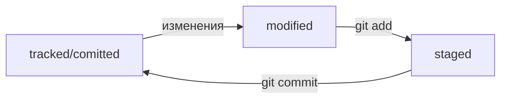

# Шпаргалка по основным командам Git

## Сделать папку репозиторием — `git init`

```bash
$ mkdir -p ~/dev/first-project # создали каталог dev, каталог проекта

$ cd ~/dev/first-project # перешли в нужный каталог

$ git init # создали репозиторий
```

## «Разгитить» папку, если что-то пошло не так, — `rm -rf .git`

```bash
$ cd <папка с репозиторием> # перешли в папку

$ rm -rf .git # удалили подпапку .git
```
## Проверить состояние репозитория — `git status`

```bash
$ git status # создали репозиторий
```

## Подготовить файлы к сохранению — `git add`

```bash
$ touch todo.txt readme.txt # создали файлы todo.txt и readme.txt

$ git status # проверили статус

$ git add --all # подготовили к сохранению все файлы в репозитории

$ touch new.txt
$ git add new.txt # добавить один файл new.txt

$ git add . # а можно добавить всю текущую папку
```

## Удаление файла из репозитория - `git rm`

```bash
$ git rm filename.txt   # команда удаляет файла из рабочего каталога и индекса
                        # а затем добавляет изменение в индекс
```
`git rm filename` = `rm filename` + `git add .`

## Выполнить коммит — `git commit`

```bash
$ git commit -m 'initial commit'
```

## Просмотреть историю коммитов — `git log`

```bash
$ git log
```

Описание состоит из:
 * строка из цифр и латинских букв после слова commit — это хеш коммита;
 * Author — имя автора и его электронная почта;
 * Date — дата и время создания коммита;
 * в конце находится сообщение коммита.

## Получить сокращённый лог — `git log --oneline`

```bash
$ git log --oneline
```


# Инструкция по созданию репозитория на GitHub

1. Зайдите в свой профиль по ссылке https://github.com/username
2. Создайте репозиторий: **Repositories** -> **New**
3. Назовите репозиторий
4. Нажмите **Create repository**

# Доступ по SSH

## Проверка наличия SSH-ключа

```bash
$ cd ~ # перешли в домашнюю директорию

$ ls -la .ssh/ # вывели список созданных ключей 
```

Если есть файлы с похожими названиями, SSH-ключи уже создавались:
 - `id_dsa.pub`;
 - `id_ecdsa.pub`;
 - `id_ed25519.pub`;
 - `id_rsa.pub`.
 
 ## Инструкция по генерации SSH-ключа
 
 1. Для генерации SSH-пары можно использовать программу `ssh-keygen`
 
 ```bash
 $ ssh-keygen -t ed25519 -C "электронная почта, к которой привязан ваш аккаунт на GitHub"
 
 # или
 
 $ ssh-keygen -t rsa -b 4096 -C "электронная почта, к которой привязан ваш аккаунт на GitHub"
 ```
 
 2. Укажите место хранения ключей. Например домашний каталог - просто нажмите `Enter`
 
 3. Укажите **кодовую фразу** (passphrase) для доступа к SSH-ключу. Можно оставить поле пустым
 
 4. Проверяем что ключи сгенерировались
 
 ```bash
 ls -a ~/.ssh
 ```
 Файл с расширением `.pub` - публичный, без - приватный.
 
 ## Инструкция по связыванию SSH-ключа и GitHub-аккаунта
 
 1. Скопируйте содержимое файла с публичным ключом в буфер обмена
 
 ```bash
 # скопировать содержимое ключа в буфер обмена:
 $ clip < ~/.ssh/id_rsa.pub
 
 # для ed25519:
 $ clip < ~/.ssh/id_ed25519.pub
 ```
 
 2. Перейдите на GitHub и выберите пункт Settings в меню аккаунта
 3. В меню слева нажмите на пункт **SSH and GPG keys**
 4. В открывшейся вкладке выберите **New SSH key**
 5. В поле **Title** напишите название ключа. Например, **Personal key**
 6. В поле **Key type** должно быть **Authentication Key**
 7. В поле **Key** скопируйте ваш ключ из буфера обмена
 8. Нажмите на кнопку **Add SSH key**
 9. Проверьте правильность ключа с помощью следующей команды
 
 ```bash
 $ ssh -T git@github.com
 ```
 
 В первый раз появится похожее предупреждение
 
 ```bash
 The authenticity of host 'github.com (140.82.121.4)' can't be established. ED25519 key fingerprint is SHA256:+DiY3wvvV6TuJJhbpZisF/zLDA0zPMSvHdkr4UvCOqU. This key is not known by any other names. Are you sure you want to continue connecting (yes/no/[fingerprint])?
 ```
 
 Это предупреждение сообщает, что вы никогда не соединялись с сервером GitHub. Поэтому Git не может гарантировать, что сервер является тем, за кого он себя выдаёт.
 
 Для подтверждения подлинности сервер генерирует и публикует ключи SHA256. Вы можете проверить ключи GitHub [по этой ссылке](https://docs.github.com/en/authentication/keeping-your-account-and-data-secure/githubs-ssh-key-fingerprints). Если ключ в предупреждении совпадает с тем, что вы видите на сайте, значит, сервер является действительным. Введите yes, чтобы продолжить. Вы увидите приветствие на экране.

 ```bash
 Hi %ВАШ_АККАУНТ%! You've successfully authenticated, but GitHub does not provide shell access.
 ```
 
# Связываем локальный и удалённый репозитории

## Привязать удалённый репозиторий к локальному — `git remote add`

 1. Перейдите на страницу удалённого репозитория, выберите тип `SSH` и скопируйте `URL`

 2. В каталоге локального репозитория введите команду `git remote add [name] [URL]`
 
 ```bash
 $ cd ~/dev/first-project
 $ git remote add origin git@github.com:%ИМЯ_АККАУНТА%/first-project.git
 ```
 
## Убедиться, что репозитории связаны, — `git remote -v`

```bash
$ git remote -v
origin    git@github.com:%ИМЯ_АККАУНТА%/%ИМЯ-ПРОЕКТА%.git (fetch)
origin    git@github.com:%ИМЯ_АККАУНТА%/%ИМЯ-ПРОЕКТА%.git (push)
```

## Отправить изменения на удалённый репозиторий — `git push`

```bash
$ git push -u origin main # Если команда приведёт к ошибке, попробуйте 
                          # заменить main на master.
```

В первый раз эту команду нужно вызвать с флагом `-u` и параметрами `origin`  и `main` (или `master`).
Флаг `-u` свяжет локальную ветку с одноимённой удалённой.

В дальнейшем при работе с удалённым репозиторием флаг `-u` можно опустить и писать просто `git push`.


# Файл HEAD

Файл `HEAD` — один из служебных файлов папки `.git`. Он указывает на коммит, который сделан последним (то есть на самый новый).

```bash
$ pwd # посмотрели, где мы
/Users/user/dev/first-project

$ cd .git/
$ ls # посмотрели, какие есть файлы
COMMIT_EDITMSG  ORIG_HEAD  description  index  logs/     refs/
HEAD            config     hooks/       info/  objects/

$ cat HEAD # команда cat показывает содержимое файла
ref: refs/heads/master # в файле вот такая ссылка
```

Внутри `HEAD` — ссылка на служебный файл: `refs/heads/master`

Если заглянуть в этот файл, можно увидеть хеш последнего коммита.

```bash
$ cat refs/heads/master # взяли ссылку из файла HEAD
# внутри хеш
e007f5035f113f9abca78fe2149c593959da5eb7

$ git log 
# сверяем с хешем последнего коммита
commit e007f5035f113f9abca78fe2149c593959da5eb7
Author: John Doe <johndoe@example.com>
Date:   Tue Mar 28 00:26:53 2023 +0300

    Добавить амбиций в список дел

... # другие коммиты 
```


# Статусы файлов в Git




# Оформление сообщений к коммитам

В выводе команды `git log --oneline` умещается максимум 72 первых символа сообщения, поэтому многие правила включают пункт: *«Сообщение не должно быть длиннее 72 символов»*.

У каждого коммита в Git есть сообщение — то, что передаётся после параметра `-m`.

Общие рекомендации:
 * сообщение должно быть относительно коротким, чтобы его было легко прочитать;
 * сообщение должно быть информативным.


В корпоративном стиле в начале сообщения обычно указывают Jira-ID, а после — текст сообщения.

```bash
$ git commit -m "LGS-123: Дополнить список пасхалок новыми числами"
```

**Conventional Commits** предлагает такой формат коммита: `<type>: <сообщение>`.
 * `feat` — для новой функциональности;
 * `fix` — для исправленных ошибок.

Подробнее [тут](https://www.conventionalcommits.org/ru/v1.0.0-beta.4/#%D1%81%D0%BF%D0%B5%D1%86%D0%B8%D1%84%D0%B8%D0%BA%D0%B0%D1%86%D0%B8%D1%8F).

**GitHub** можно использовать для ведения списка задач *(issue)* проекта. Если коммит «закрывает» или «решает» какую-то задачу, то в его сообщении удобно указывать ссылку на неё. Для этого в любом месте сообщения нужно указать `#<номер задачи>`.

```bash
$ git commit -m "Исправить #334, добавить график температуры" 
```

В таком случае GitHub свяжет коммит и задачу.


# Как исправить коммит

В уже сделанный *commit* можно внести правки с помощью опции `--amend`.

Флаг `--amend` работает *только* с последним коммитом **HEAD**

## Дополнить коммит новыми файлами — `git commit --amend --no-edit`

```bash
$ mkdir ~/dev/commit-amend-fun
$ cd ~/dev/commit-amend-fun
$ git init
# пропустим вывод git init 
$ touch main.html
$ touch common.css
# дальше отредактировали оба файла
$ git add main.html
$ git commit -m "Добавить главную страницу"
$ git log --oneline
777fec3 Добавить главную страницу 
# файл common.css так и остался «висеть» в untracked
$ git add common.css
# добавили файл common.css в список на коммит как обычно
# но вместо команды commit -m '...'
# будет:
$ git commit --amend --no-edit
$ git log --oneline
8340eb2 Добавить главную страницу
# коммит в истории всё ещё один (но у него новый хеш) 
```
Опция `--no-edit` сообщает команде commit, что сообщение коммита нужно оставить как было.

## Изменить сообщение коммита — `git commit --amend -m "Новое сообщение"`
```bash
$ git commit --amend -m "Добавить главную страницу и стили"
$ git log --oneline
a31fa24 Добавить главную страницу и стили # Хеш коммита снова поменялся
```

# Как откатиться назад, если «всё сломалось»

## Выполнить unstage изменений — `git restore --staged <file>`

Убрать файл из *staging area* (`git add`) можно командой `git restore --staged <file>`.

```bash
$ touch example.txt # создали ненужный файл
$ git add example.txt # добавили его в staged

$ git status # проверили статус
Changes to be committed:
  (use "git restore --staged <file>..." to unstage)
        new file:   example.txt

$ git restore --staged example.txt
$ git status # проверили статус

Untracked files:
  (use "git add <file>..." to include in what will be committed)
        example.txt

no changes added to commit (use "git add" and/or "git commit -a")
# файл example.txt из staged вернулся обратно в untracked
```

Чтобы *«сбросить»* **все** файлы из `staged` обратно в `untracked`/`modified`, можно воспользоваться командой `git restore --staged .` она сбросит всю *текущую* папку.


## «Откатить» коммит — `git reset --hard <commit hash>`

Вернуть состояние репозитория к более раннему: «откатить» то, что уже было закоммичено, можно командой: `git reset --hard <commit hash>`

```bash
$ git log --oneline # хеш можно найти в истории
7b972f5 (HEAD -> master) style: добавить комментарии, расставить отступы
b576d89 feat: добавить массив Expenses и цикл для добавления трат # вот сюда и вернёмся
4b58962 refactor: разделить analyzeExpenses() на countSum() и saveExpenses()

$ git reset --hard b576d89
# теперь мы на этом коммите
HEAD is now at b576d89 feat: добавить массив Expenses и цикл для добавления трат
```

Коммит `b576d89` стал последним, а коммит `7b972f5` Git просто удалил.


## «Откатить» изменения, которые не попали ни в staging, ни в коммит, — `git restore <file>`

Случайно изменили файл, который не планировали? Чтобы вернуть всё «как было», поможет команда `git restore <file>`.

```bash
# случайно изменили файл example.txt
$ git status
On branch main
Changes not staged for commit:
  (use "git add <file>..." to update what will be committed)
  (use "git restore <file>..." to discard changes in working directory)
          modified:   example.txt

$ git restore example.txt
$ git status
On branch main
nothing to commit, working tree clean
```

# Просматриваем изменения в файлах

Команда `git diff` сравнит последнюю закоммиченную версию файла с той, что находится в состоянии `modified`.

Команда `git diff --staged` покажет изменения в `staged`-файлах относительно последних закоммиченных версий.

По сути команда `git diff A B` выводит список инструкций: как превратить состояние `A` в состояние `B`. Если поменять `A` и `B` местами `git diff B A`, то и инструкции будут обратные: как превратить `B` в `A`. При этом все зелёные строки станут красными, и наоборот.


# Игнорирование файлов в Git

В `.gitignore` указывают все файлы, которые нужно игнорировать. Правила из `.gitignore` применяются только к новым `untracked` файлам. Если файл уже попал в `staging area` или в `коммит`, то правила на него не распространяются.

```bash
.DS_Store  # Git будет игнорировать файлы с именем .DS_Store в корне репозитория, и во всех вложенных папках.

# игнорировать все файлы, которые заканчиваются на .jpeg
*.jpeg

# игнорировать все файлы "tmp" во всех подпапках папки docs
docs/*/tmp

# Вопросительный знак ? соответствует одному любому символу.
# файл file12.txt не будет проигнорирован!!!
file?.txt

# игнорировать файлы file0.txt, file1.txt и file2.txt
# при этом не игнорировать file3.txt, file4.txt, ...
file[0-2].txt

# игнорировать todo.txt только в корне репозитория
# однако файл subdir/todo.txt по-прежнему отслеживается
/todo.txt
# для сравнения: spam.txt будет игнорироваться во всех папках
spam.txt

# игнорировать папку build
build/

# игнорировать файлы "docs/current/tmp", "docs/old/tmp",
# а также "docs/old/saved/a/b/c/d/tmp"
# и даже "docs/tmp", потому что ноль вложенных папок тоже подходит
docs/**/tmp

# игнорировать только "docs/current/tmp" и "docs/old/tmp"
# файл "docs/old/saved/a/b/c/d/tmp" не попадает в правило
docs/*/tmp

# Восклицательный знак (!)
# игнорировать все JPEG-файлы
*.jpeg
# но только не мем с Doge
!doge.jpeg

```

:lamp: Если задать правило, которое состоит только из звёздочки, Git будет игнорировать все файлы.

```bash
# странное, но возможное правило
# "игнорировать все файлы"
*
```

Если нужно отобразить все игнорируемые файлы, то это можно сделать с помощью ключа `--ignored`: `git status --ignored`. В таком случае в выводе `git status` появится раздел `Ignored files`.


# Копирование репозиториев

## Клонируем репозиторий - `git clone`

Команда `git clone` автоматически связывает локальный и удалённый репозиторий

```bash
$ git clone https://github.com/bla-bla-bla/git-clone-lesson
# укажите адрес репозитория, который нужно склонировать
$ cd bla-bla-bla
$ git remote -v
origin    git@github.com:bla-bla-bla/git-clone-lesson.git (fetch)
origin    git@github.com:bla-bla-bla/git-clone-lesson.git (push)
```

## Выполняем Fork

«Форк» создаёт копию существующего репозитория в аккаунте на GitHub, позволяя вносить изменения в репозиторий независимо от оригинального проекта.


# Что такое ветка

**Ветки** — независимые потоки разработки.

## Просмотреть ветки проекта — `git branch`

При вызове `git branch` выводятся ветки, которые есть в проекте. Звёздочкой (__*__) отмечено, в какой ветке вы находитесь в текущий момент.

```bash
$ git branch 
* main # мы в основной ветке
# чтобы выйти из просмотра веток, может понадобиться Q!
```

## Создать ветку — `git branch <название_ветки>`

Используют указатели `feature` для веток, где прорабатывается новая функциональность, и `bugfix`  для веток, где ведётся работа по исправлению ошибок.

```bash
$ git branch feature/add-branch-info # создали ветку feature/add-branch-info
$ git branch # посмотрели ветки
  
  feature/add-branch-info  # появилась новая
* main                     # * значит, что мы находимся в основной ветке
```

## Переключиться на другую ветку — `git checkout <название_ветки>`

```bash
$ git checkout feature/add-branch-info # перешли в новую ветку
Switched to branch 'feature/add-branch-info'

$ git branch # проверили

* feature/add-branch-info # теперь находимся тут
  main
```

## Создать ветку и сразу переключиться на неё — `git checkout -b <название_ветки>`

Разные ветки в одном проекте существуют независимо. Изменения в одной не влияют на изменения в другой.

```bash
$ git checkout main
$ git checkout -b bugfix/fix-branch # создали ветку и сразу на неё переключились
Switched to a new branch 'bugfix/fix-branch'

$ git branch
* bugfix/fix-branch # сразу в нужной ветке
  feature/add-branch-info
  main
```

## Сравнить ветки — `git diff <название_ветки1> <название_ветки2>`

Команда `git diff` покажет изменения в *«рабочей зоне»*, то есть в *modified*-файлах.

```bash
$ git diff main feature/diff # сравнили ветки main и feature/diff

diff --git a/README.md b/README.md
index 86b1ff4..fff4920 100644
--- a/README.md
+++ b/README.md
@@ -1,3 +1,5 @@
# Ветки в Git 

# ...

$ git diff main 2ea56ab
# вывод будет такой же, как при использовании git diff main feature/diff
```

## Суффикс навигации `~N`

`N` — это число коммитов назад во времени. Нумерация начинается с нуля: `commit~0` — это сам коммит, `commit~1` — предыдущий, `commit~2` — предшествующий предыдущему и так далее.

Например, `HEAD~1` — это следующий за текущим коммит. А `main~5` — это пятый коммит в ветке main, если считать с последнего выполненного коммита.

Для `~1` есть специальное сокращение `~` (без числа).

```bash
$ git diff HEAD~ HEAD

$ git diff feature/diff~1 feature/diff

$ git diff 2ea56ab~ 2ea56ab
```

